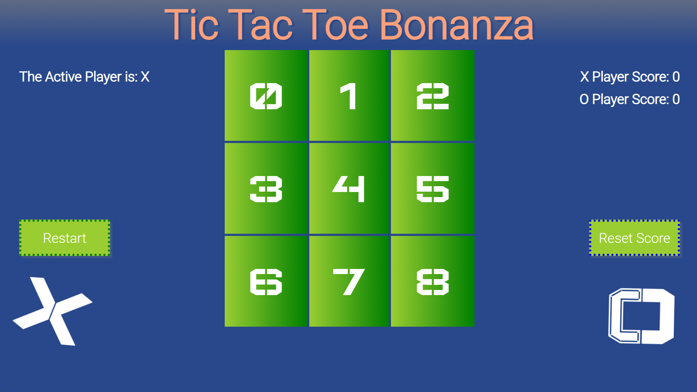

# mod1TheGame  Tic Tac Toe Bonanza

## Engaging game of tic tac toe to be played via couch co-op in the convenience of a browser game without need for paper and pencils.

Three (3) person project for Mod 1 - The Game assignment (Per Scholas bootcamp project)  
- Goal of project wasL to use the functionalities of HTML5/CSS and JavaScript to explore game making
- Group Members: jdbpt (Jocelyn), Christienne, and Sanikwa
- Each had our separate repositories and code, each project is unique in some manner of design (code/function and UI appearance) for each group member
  
Thanks to [Per Scholas](https://perscholas.org/) for the WISE program (Women in Software Engineering bookcamp)!
- Note: this project was for educational purposes, created during the duration of the Per Scholas bootcamp.

### GitHub pages site
 https://jdbpt.github.io/mod1TheGame/

### Technology
HTML5/CSS and JavaScript, Visual Studio Code, Corel Painter 2021 student edition

### Resources
W3Schools, Mozilla mdn web docs, Mod 1 specifications

### Tic Tac Toe inspirations and guidance: 

Coding With Siphiwo
Create a Simple Tic Tac Toe Game with JavaScript, HTML & CSS for Beginners | 2022 Tutorial 
YouTube
 https://www.youtube.com/watch?v=oZrp3Atkz18

JavaScript Academy
Create a simple tic tac toe game using HTML, CSS, JavaScript
YouTube
 https://www.youtube.com/watch?v=B3pmT7Cpi24&list=LL&index=4&t=3s  

Code with Ania Kubów
Super Easy Tic-tac-toe in JavaScript!
YouTube
https://www.youtube.com/watch?v=DRaWr0Dcbl0&list=LL&index=3 

### Dev Log

07/04/2023 - pushed code and updated with all basic game functionality 
Next step is adding further design features and UI additions

07/05-06/2023 - Updated game with more CSS design such as gradients and added some button transformations.  Added scoring and a reset button for the score.  Updated the JS for the restart button to reset some variables to starting values including the innerHTML of the grid items, but maintain score. Added a text shadow behind the X and Os when clicked/added to the board

07/06/2023 - Updated game with slight CSS changes, adding cursor pointer over the game board to show it is clickable and cleaning some JS code/comments

07/08/2023 - Updated game with some color change of the winning squares, and increased the opacity of the gradient on the header. 

07/10/2023 - Updated CSS for some text-shadow on title, and bigger text.  Added two images with alt-text placeholders to prep for image addition to be completed tomorrow

07/10/2023 - Decided to not create own image and instead use the font already in use.  Then added some animations with help from Mozilla website, and some color change behind the decoration of X and O to indicate winners or tie.

07/12/2023 - Final major push, added a favicon
